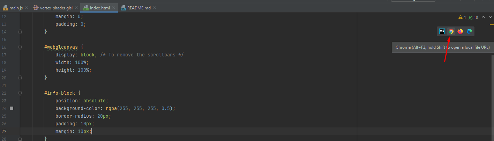

# IMPORTANT!
Please, rename all `.js1` files (including that ones in `./Utils`) to just normal
`.js` extension!  
Also, you need to run `index.html` on a server in order to XMLHttpRequests 
to work with local files (I'm loading shaders and textures via `fetch`).
In WebStorm I was running it via this feature:

